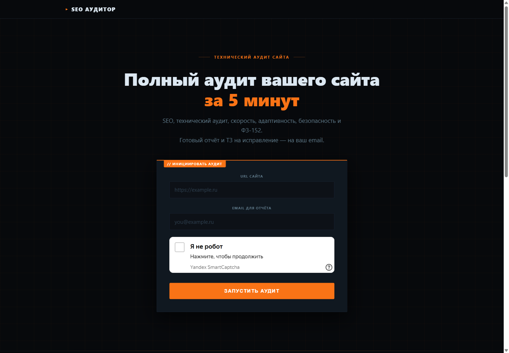
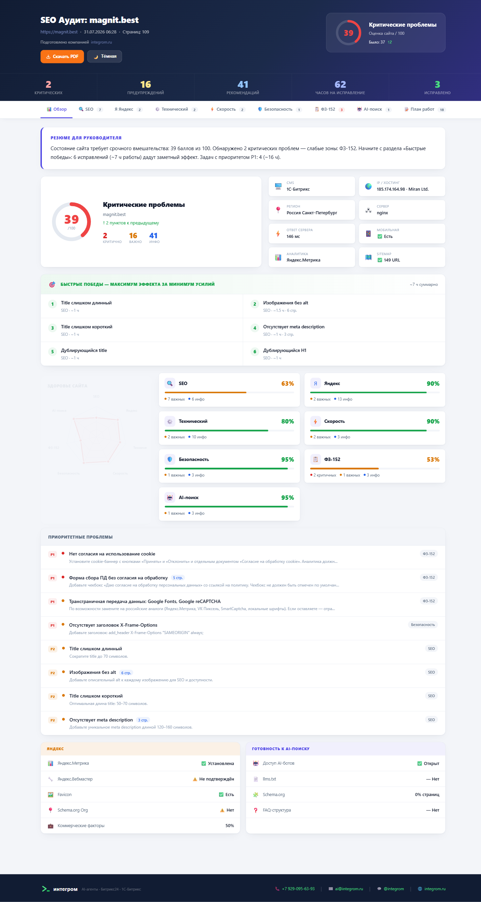
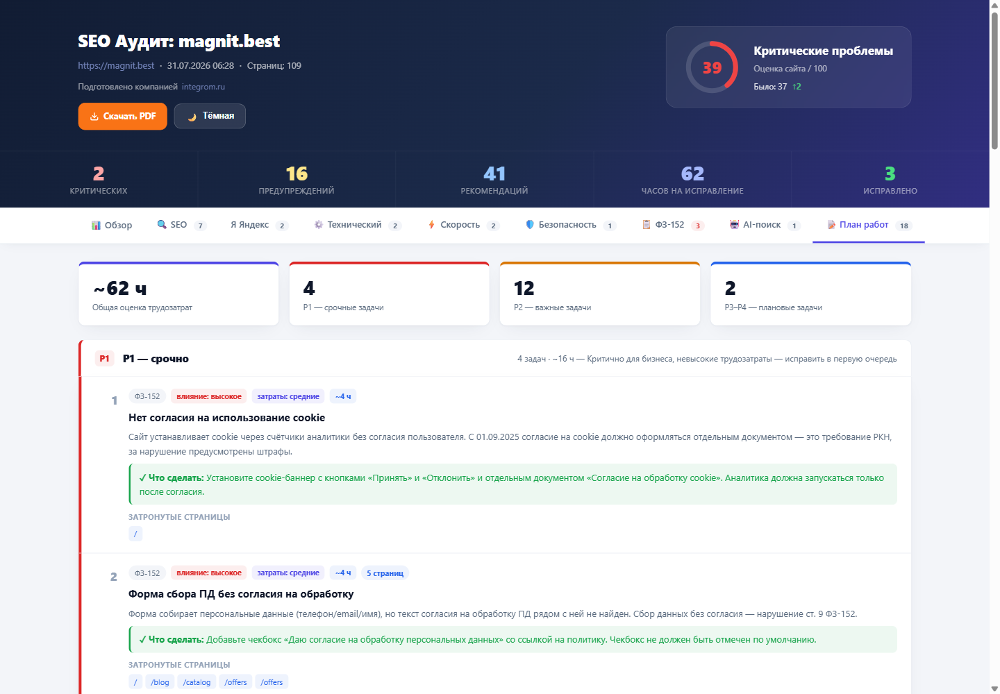
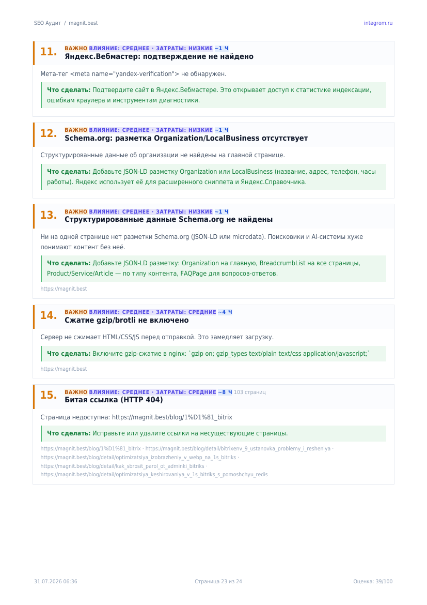
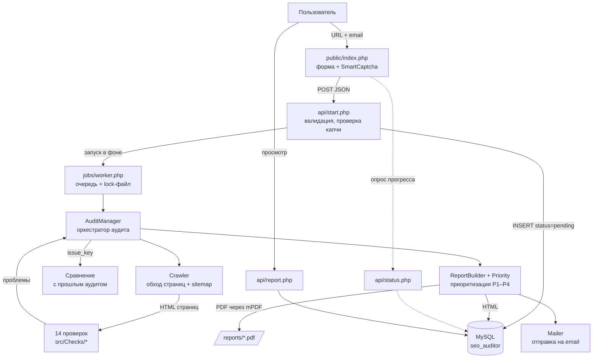
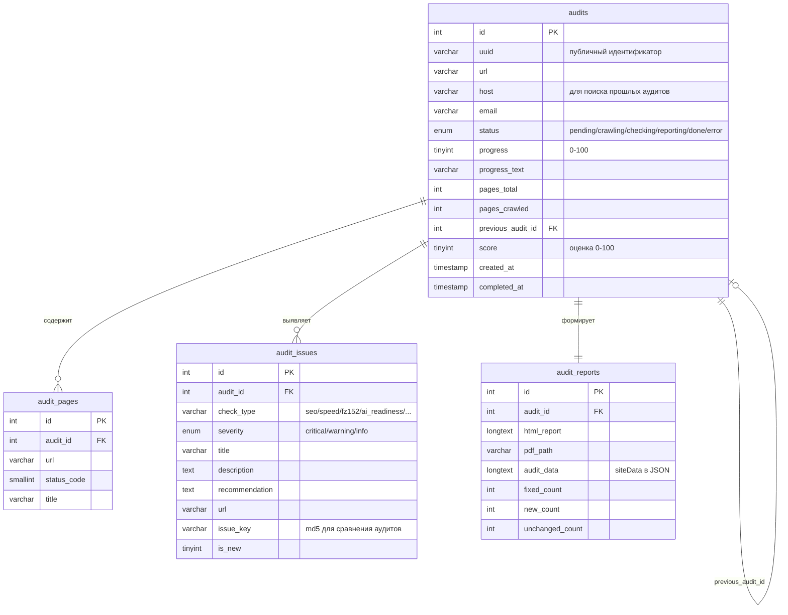

# SEO Аудитор

Веб-приложение автоматического SEO и технического аудита сайтов. На входе — URL сайта
и email, на выходе — интерактивный HTML-отчёт и PDF с планом работ по приоритетам.

**Демо:** https://seo.magnit365.ru



## Как это выглядит

Отчёт открывается на вкладке «Обзор»: резюме для руководителя, общая оценка,
блок «Быстрые победы» и здоровье по каждому направлению.



Вкладка «План работ» — задачи, сгруппированные по приоритетам P1–P4, с оценкой
влияния, трудозатрат и часов на каждую.



Отчёт переключается между светлой и тёмной темой, выбор запоминается.


Тот же отчёт выгружается в PDF — с обложкой и планом работ, пригодный для отправки клиенту.

<p>
  
  
</p>

## Возможности

| Категория | Что проверяется |
|---|---|
| SEO | title, description, H1–H6, alt, canonical, robots.txt, sitemap.xml, Open Graph, дубли |
| Внутренние ссылки | перелинковка, страницы-тупики, входящие ссылки, внешние ссылки |
| Технический аудит | HTTPS, редиректы, HTTP/2, gzip, кэширование, битые ссылки и ресурсы, 404 |
| Скорость | время ответа, полевые Core Web Vitals (LCP / INP / CLS), lazy load, WebP/AVIF |
| Адаптивность | viewport, медиа-запросы, мобильная вёрстка |
| Безопасность | CSP, HSTS, X-Frame-Options, открытые `.env` / `.git`, mixed content, панели админки |
| ФЗ-152 | политика ПД, cookie-согласие (требования 2025), чекбоксы в формах, трансграничная передача, локализация данных |
| Яндекс SEO | Метрика, Вебмастер, favicon, Schema.org, гео-мета, Турбо-страницы |
| Коммерческие факторы | телефон, адрес, режим работы, оплата, отзывы, онлайн-чат, реквизиты |
| AI-готовность | доступ AI-краулеров, llms.txt, покрытие Schema.org, структура под AI-цитирование |
| CMS и хостинг | определение CMS, версии ПО, JS-фреймворки, IP, регион, провайдер |

Дополнительно: сравнение с предыдущим аудитом того же домена (исправлено / новое / осталось),
блок «Быстрые победы», оценка трудозатрат в часах, светлая и тёмная темы отчёта.

## Технологический стек

- **Бэкенд:** PHP 8.2+ (для запуска тестов нужен 8.3+), Composer (PSR-4)
- **БД:** MariaDB 10.11 / MySQL
- **Фронтенд:** vanilla JavaScript, CSS без фреймворков
- **Библиотеки:** Guzzle 8 (HTTP), Symfony DomCrawler 7 (парсинг), mPDF 8 (PDF), PHPMailer 7 (почта)
- **Инфраструктура:** Nginx, PHP-FPM, Let's Encrypt, Яндекс SmartCaptcha

## Архитектура



### Схема базы данных



### Как считается оценка

Штрафуются **уникальные** проблемы (тип проверки + базовый заголовок), а не постраничные
записи: одна ошибка на 78 страницах — это одна задача, а не 78 штрафов.

```
Общая оценка   = 100 − 12 × критичных − 2 × важных
Оценка раздела = 100 − 21 × критичных − 5 × важных
```

### Приоритизация задач

`src/Report/Priority.php` оценивает каждую проблему по двум осям и выдаёт приоритет
и ориентировочные трудозатраты в часах:

- **Влияние** (1–3) — от критичности; для безопасности и ФЗ-152 повышается принудительно
- **Трудозатраты** (1–3) — от типа проверки, с поправками по заголовку проблемы
- **Приоритет** — матрица «влияние × трудозатраты» → P1 (срочно) … P4 (по возможности)
- **Быстрые победы** — значимое влияние при минимальных трудозатратах

## Производительность обхода

Страницы загружаются параллельно через Guzzle Pool, волнами в ширину: очередь
текущего уровня скачивается одновременно, найденные на ней ссылки образуют
следующую волну. Степень параллелизма — `CRAWLER_CONCURRENCY` (по умолчанию 8).

Замер выполняется скриптом `bin/benchmark_crawl.php` — каждый режим прогоняется
несколько раз, берётся медиана:

```bash
php bin/benchmark_crawl.php https://example.com --pages=20 --runs=3 --levels=1,4,8
```

Результат на сайте с обычной сетевой задержкой (20 страниц, медиана из 2 прогонов):

| Потоков | Время | Страниц/с | Ускорение |
|---:|---:|---:|---:|
| 1 (было) | 8.97 с | 2.2 | — |
| 4 | 3.33 с | 6.0 | в 2.7 раза |
| 8 | 3.09 с | 6.5 | **в 2.9 раза** |

Профилирование дало два вывода, которые стоит знать:

1. **Разбор HTML стоил дороже загрузки.** На быстром сайте 25 страниц скачивались
   за 0.39 с, а весь обход занимал 1.32 с — почти секунда уходила на построение DOM
   через `Symfony\DomCrawler` ради поиска ссылок. Для сбора ссылок точность DOM не нужна:
   извлечение заменено на целевой разбор разметки (`UrlTools::extractHrefs`), ложные
   срабатывания всё равно отсеиваются проверками домена и расширения.
2. **Параллелизм помогает не всегда.** На быстром сайте в том же дата-центре прироста
   почти нет: сервер ограничивает число одновременных соединений с одного адреса, и
   запросы выстраиваются в очередь на его стороне — суммарное время ответов растёт,
   а общее время не падает. Выигрыш появляется там, где доминирует сетевая задержка,
   то есть на большинстве реальных клиентских сайтов.

Попутно исправлена потеря страниц: относительные ссылки вида `href="page.html"`
и `href="../up"` раньше отбрасывались, из-за чего сайты с относительной навигацией
обходились не полностью. Теперь адреса разрешаются относительно текущей страницы.

## Безопасность

**Защита от SSRF.** Краулер ходит по адресу, который назвал пользователь, поэтому
`src/Core/UrlGuard.php` проверяет каждый URL до запроса:

- разрешены только схемы `http` / `https` и веб-порты (80, 443, 8080, 8443, 8000, 3000) —
  иначе через `http://host:6379/` можно было бы обращаться к внутренним службам;
- имя хоста резолвится в IP, и все полученные адреса проверяются на принадлежность
  приватным и зарезервированным диапазонам (`127/8`, `10/8`, `172.16/12`, `192.168/16`,
  `169.254/16` — включая сервис метаданных облака, `::1`, `fc00::/7`);
- если у домена несколько A-записей, достаточно одного внутреннего адреса для отказа;
- служебные имена (`localhost`, `*.local`, `*.internal`, `metadata.google.internal`)
  отсекаются до обращения к DNS;
- **каждый редирект проверяется отдельно** — иначе внешний сайт мог бы перебросить
  краулер на внутренний адрес;
- вложенные `sitemap.xml` с чужого хоста тоже проходят проверку.

Известное ограничение: между проверкой DNS и установкой соединения адрес теоретически
может измениться (DNS rebinding). Полное закрытие требует соединения по уже
проверенному IP с подстановкой заголовка `Host`.

**Ограничение частоты запросов.** `src/Core/RateLimiter.php` — скользящее окно на файлах,
без изменения схемы БД. Лимиты двухуровневые: мягкий (30 запросов в час) ограничивает
поток обращений к API, строгий (5 в час, 20 в сутки) считает только реально созданные
аудиты — поэтому неудачные попытки капчи не расходуют квоту пользователя.
Дополнительно не допускается более трёх одновременно выполняющихся аудитов.

IP-адрес является персональными данными по ФЗ-152, поэтому в файлах счётчиков хранится
только его HMAC-хеш — ни в имени файла, ни внутри открытого IP нет.

**Прочее:** ввод валидируется до обращения к капче (чтобы опечатка не стоила исходящего
запроса), защита от автоматизации — Яндекс SmartCaptcha, все запросы к БД параметризованы
через PDO с отключённой эмуляцией подготовленных выражений, секреты только в `.env`.

## Тестирование

```bash
composer install          # включая dev-зависимости
composer test             # или ./vendor/bin/phpunit
./vendor/bin/phpunit --testdox   # с читаемыми названиями проверок
```

133 модульных теста на чистую логику, не требующую сети и БД:

| Набор | Что проверяет |
|---|---|
| `ScoreTest` | формула оценки, в том числе что одна проблема на 78 страницах штрафуется один раз |
| `PriorityTest` | матрица «влияние × трудозатраты», оценка часов, отбор быстрых побед |
| `UrlGuardTest` | защита от SSRF: 12 видов внутренних адресов, опасные схемы и порты |
| `RateLimiterTest` | скользящее окно, независимость клиентов, отсутствие IP в открытом виде |
| `RobotsTxtTest` | разбор robots.txt: группы агентов, `Allow` поверх `Disallow`, комментарии |
| `EnvTest` | чтение `.env`: кавычки, `=` внутри значения, приведение типов |
| `UrlToolsTest` | нормализация адресов, разрешение относительных ссылок (`../up`, `./here`), извлечение ссылок из разметки |
| `CodeStyleTest` | сторож против ловушек: интерполяция внутри «…», секреты в коде, отладочные вызовы |

Про `CodeStyleTest` стоит пояснить: в двойных кавычках запись `"«$var»"` не работает —
закрывающая ёлочка состоит из байтов ≥ 0x80, которые PHP считает допустимыми в имени
переменной, и ищет несуществующую `$var»`. Ошибка встречалась в проекте трижды, поэтому
теперь её ловит тест.

## Структура проекта

```
├── api/                    REST-эндпоинты (start, status, report, pdf)
├── bin/                    CLI: check_env.php (диагностика), audit.php (аудит),
│                           benchmark_crawl.php (замер скорости обхода)
├── config/config.php       конфигурация (читает .env)
├── jobs/worker.php         фоновый обработчик очереди
├── public/                 веб-рут: форма, страница прогресса, статика
├── sql/                    схема БД и миграции
├── src/
│   ├── Audit/              AuditManager — оркестратор аудита
│   ├── Checks/             14 модулей проверок (наследуют BaseCheck)
│   ├── Core/               Config, Env, Database, Crawler, UrlGuard, UrlTools,
│   │                       RateLimiter, RobotsTxt
│   ├── Email/              отправка отчёта
│   └── Report/             ReportBuilder, Priority, Score
├── templates/              шаблоны HTML- и PDF-отчёта
└── tests/Unit/             модульные тесты (PHPUnit)
```

Все проверки наследуют `BaseCheck` и реализуют единый контракт — новую проверку
достаточно добавить в массив `$checks` в `AuditManager::run()`:

```php
public function run(array $pages, array &$siteData): array
```

## Установка

Требуется PHP ≥ 8.2 (тесты — 8.3+) с расширениями `pdo_mysql`, `curl`, `mbstring`,
`dom`, `json`, `gd`, а также MySQL/MariaDB и Composer.

```bash
git clone https://github.com/Integrom/seo-auditor.git
cd seo-auditor
composer install
php bin/install.php
```

Установщик спросит адрес сайта, часовой пояс и доступ к базе, создаст `.env` и каталоги,
применит схему и проверит окружение. Если базы ещё нет — попросит доступ администратора
MySQL и заведёт её сам.

Автоматический режим, без вопросов:

```bash
php bin/install.php --no-interaction \
  --url=http://localhost:8000 \
  --db-name=seo_auditor --db-user=seo_user --db-pass=секрет
```

Все ключи: `php bin/install.php --help`.

### Первый аудит

Веб-форма защищена капчей, поэтому для проверки удобнее консоль:

```bash
php bin/audit.php https://example.com you@example.com --pages=5
php -S localhost:8000 -t public
```

Отчёт откроется по адресу `http://localhost:8000/api/report.php?id=<UUID из вывода>`.
Чтобы заработала форма на сайте, добавьте в `.env` ключи Яндекс SmartCaptcha.

### Инструменты командной строки

| Команда | Назначение |
|---|---|
| `php bin/install.php` | установка: конфигурация, база, каталоги |
| `php bin/check_env.php` | диагностика окружения, 20+ проверок |
| `php bin/audit.php <url> [email] [--pages=N]` | аудит из консоли, минуя капчу |
| `php bin/regen_pdf.php <uuid\|last>` | пересобрать PDF без повторного обхода |
| `php bin/benchmark_crawl.php <url>` | замер скорости обхода |
| `composer test` | модульные тесты |

## Развёртывание на сервере

Для чистого VPS (AlmaLinux 9 и другие RHEL-совместимые) есть скрипт, который ставит
виртуальный хост, SSL от Let's Encrypt, базу и cron для фоновой очереди:

```bash
DOMAIN=seo.example.ru ADMIN_EMAIL=admin@example.ru \
  ssh user@server 'bash -s' < setup_server.sh
```

Дальше на сервере — `composer install --no-dev` и `php bin/install.php`. Веб-рут должен
указывать на `public/`, каталоги `reports/` и `logs/` — быть доступны на запись
пользователю PHP-FPM.

Обновление кода на уже развёрнутом сервере:

```bash
DEPLOY_SERVER=user@example.com DEPLOY_REMOTE=/var/www/seo-auditor ./deploy.sh
```

Скрипт отправляет только изменённые в git файлы и пересобирает автолоадер Composer —
это обязательно после добавления новых классов, потому что автолоадер оптимизирован.

## Лицензия

Проект разработан как дипломная работа.
