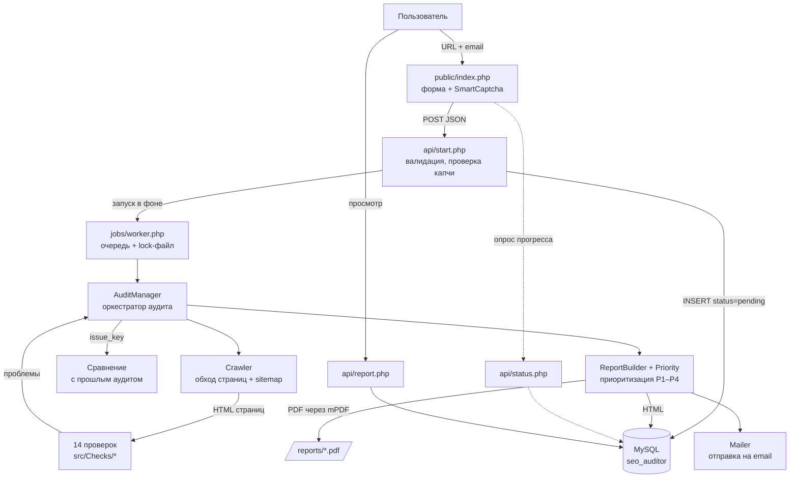
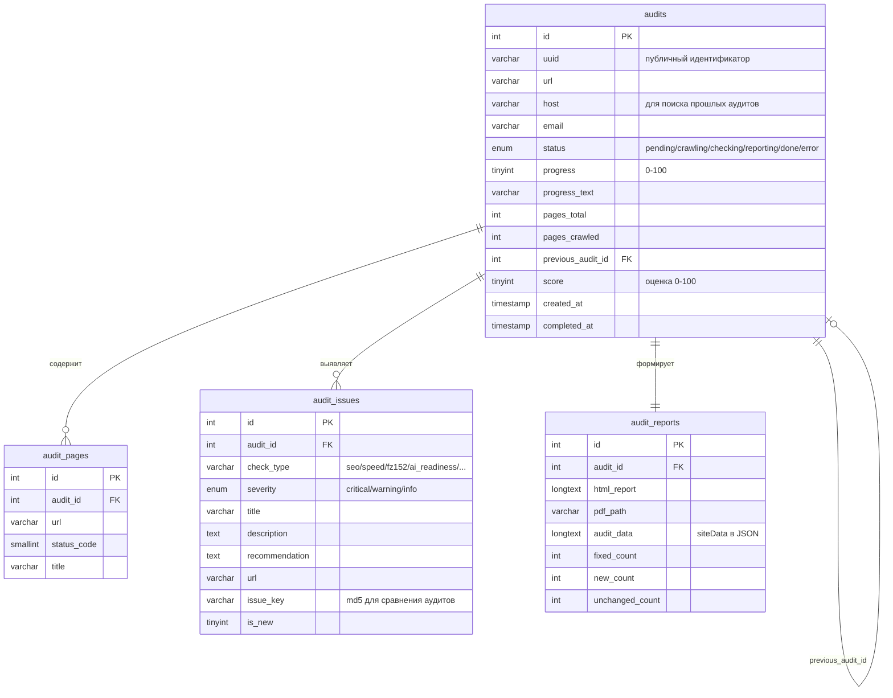

# SEO Аудитор

Веб-приложение автоматического SEO и технического аудита сайтов. На входе — URL сайта
и email, на выходе — интерактивный HTML-отчёт и PDF с планом работ по приоритетам.

**Демо:** https://seo.magnit365.ru

## Возможности

| Категория | Что проверяется |
|---|---|
| SEO | title, description, H1–H6, alt, canonical, robots.txt, sitemap.xml, Open Graph, дубли |
| Внутренние ссылки | перелинковка, страницы-тупики, входящие ссылки, внешние ссылки |
| Технический аудит | HTTPS, редиректы, HTTP/2, gzip, кэширование, битые ссылки и ресурсы, 404 |
| Скорость | время ответа, полевые Core Web Vitals (LCP / INP / CLS), lazy load, WebP/AVIF |
| Адаптивность | viewport, медиа-запросы, мобильная вёрстка |
| Безопасность | CSP, HSTS, X-Frame-Options, открытые `.env` / `.git`, mixed content, панели админки |
| ФЗ-152 | политика ПД, cookie-согласие (требования 2025), чекбоксы в формах, трансграничная передача, локализация данных |
| Яндекс SEO | Метрика, Вебмастер, favicon, Schema.org, гео-мета, Турбо-страницы |
| Коммерческие факторы | телефон, адрес, режим работы, оплата, отзывы, онлайн-чат, реквизиты |
| AI-готовность | доступ AI-краулеров, llms.txt, покрытие Schema.org, структура под AI-цитирование |
| CMS и хостинг | определение CMS, версии ПО, JS-фреймворки, IP, регион, провайдер |

Дополнительно: сравнение с предыдущим аудитом того же домена (исправлено / новое / осталось),
блок «Быстрые победы», оценка трудозатрат в часах, светлая и тёмная темы отчёта.

## Технологический стек

- **Бэкенд:** PHP 8.3, Composer (PSR-4)
- **БД:** MariaDB 10.11 / MySQL
- **Фронтенд:** vanilla JavaScript, CSS без фреймворков
- **Библиотеки:** Guzzle (HTTP), Symfony DomCrawler (парсинг), mPDF (PDF), PHPMailer (почта)
- **Инфраструктура:** Nginx, PHP-FPM, Let's Encrypt, Яндекс SmartCaptcha

## Архитектура



### Схема базы данных



### Как считается оценка

Штрафуются **уникальные** проблемы (тип проверки + базовый заголовок), а не постраничные
записи: одна ошибка на 78 страницах — это одна задача, а не 78 штрафов.

```
Общая оценка   = 100 − 12 × критичных − 2 × важных
Оценка раздела = 100 − 21 × критичных − 5 × важных
```

### Приоритизация задач

`src/Report/Priority.php` оценивает каждую проблему по двум осям и выдаёт приоритет
и ориентировочные трудозатраты в часах:

- **Влияние** (1–3) — от критичности; для безопасности и ФЗ-152 повышается принудительно
- **Трудозатраты** (1–3) — от типа проверки, с поправками по заголовку проблемы
- **Приоритет** — матрица «влияние × трудозатраты» → P1 (срочно) … P4 (по возможности)
- **Быстрые победы** — значимое влияние при минимальных трудозатратах

## Структура проекта

```
├── api/                    REST-эндпоинты (start, status, report, pdf)
├── config/config.php       конфигурация (читает .env)
├── jobs/worker.php         фоновый обработчик очереди
├── public/                 веб-рут: форма, страница прогресса, статика
├── sql/                    схема БД и миграции
├── src/
│   ├── Audit/              AuditManager — оркестратор аудита
│   ├── Checks/             14 модулей проверок (наследуют BaseCheck)
│   ├── Core/               Config, Env, Database, Crawler
│   ├── Email/              отправка отчёта
│   └── Report/             ReportBuilder, Priority
└── templates/              шаблоны HTML- и PDF-отчёта
```

Все проверки наследуют `BaseCheck` и реализуют единый контракт — новую проверку
достаточно добавить в массив `$checks` в `AuditManager::run()`:

```php
public function run(array $pages, array &$siteData): array
```

## Установка

Требуется PHP ≥ 8.1, MySQL/MariaDB, Composer.

```bash
git clone <repository-url> seo-auditor
cd seo-auditor
composer install
cp .env.example .env
```

Заполните `.env` (доступ к БД, ключи SmartCaptcha, при необходимости PageSpeed API),
создайте базу и примените схему:

```bash
mysql -u root -p -e "CREATE DATABASE seo_auditor CHARACTER SET utf8mb4 COLLATE utf8mb4_unicode_ci"
mysql -u root -p seo_auditor < sql/schema.sql
mysql -u root -p seo_auditor < sql/migration_001_comparison.sql
```

Веб-рут сервера направьте на `public/`, каталоги `reports/` и `logs/` должны быть
доступны для записи пользователю PHP-FPM.

Локальный запуск для разработки:

```bash
php -S localhost:8000 -t public
```

## Развёртывание

Скрипт `deploy.sh` копирует изменённые файлы на сервер и пересобирает автолоадер
Composer (обязательно после добавления новых классов — автолоадер оптимизирован).

## Лицензия

Проект разработан как дипломная работа.
